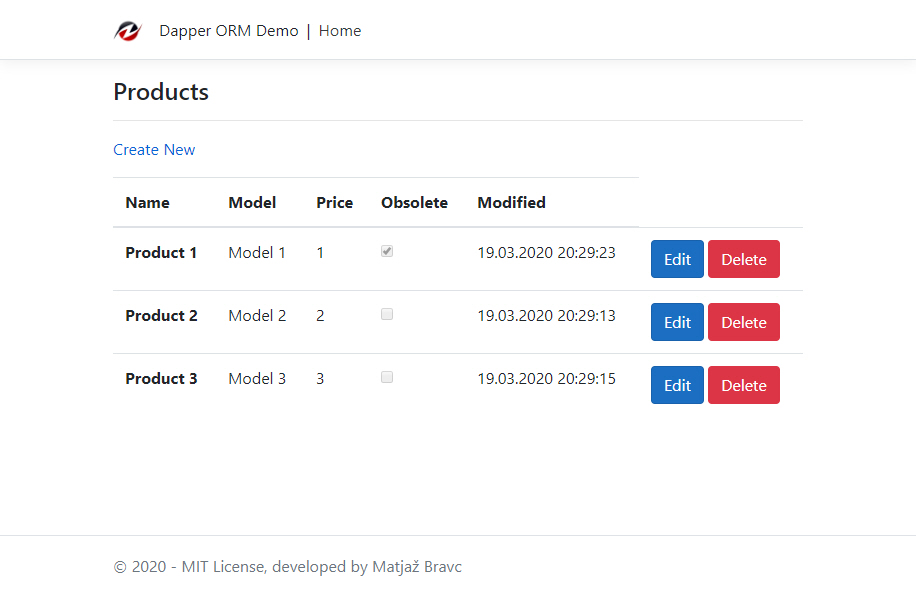
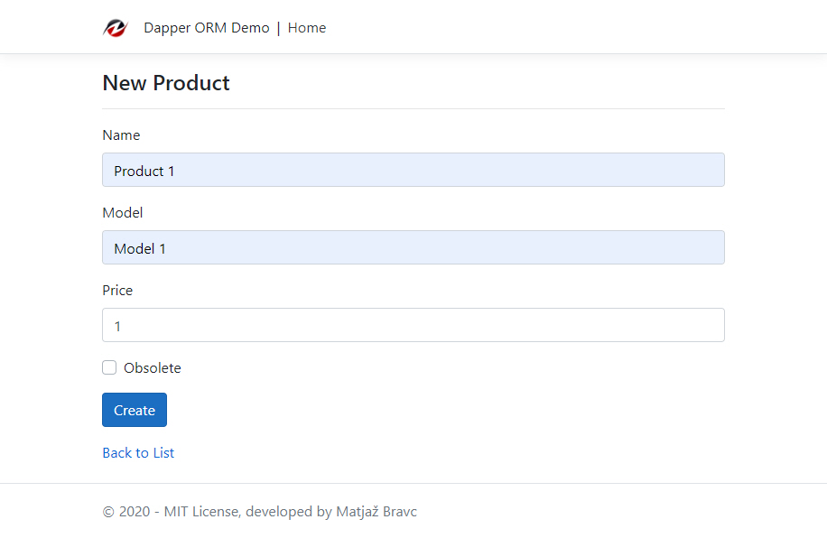
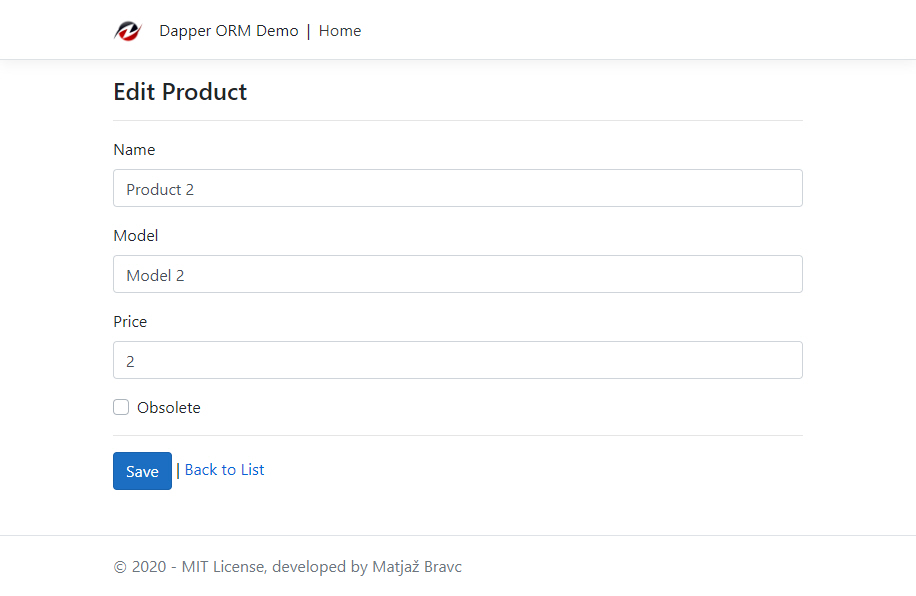
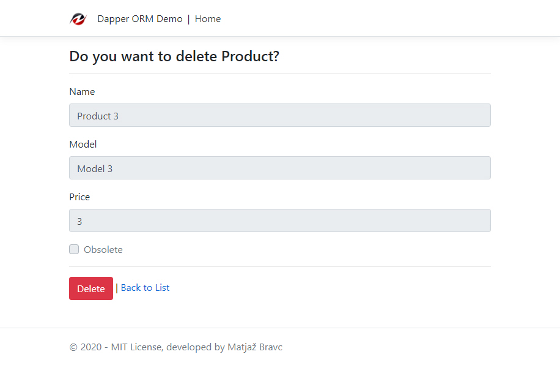

# Dapper.Razor.Demo

## What is Dapper?

[Dapper](https://stackexchange.github.io/Dapper/) - a simple object mapper for .Net. Basically it's a NuGet library that can be added to any .NET project for database operations. It's architected to focus on the most important task of working with database tables instead of creating, modifying the database schema, tracking changes etc.

## Why use it?

Dapper drastically reduces the database access code and work with any database: SQLite, SQL CE, Firebird, Oracle, MySQL, PostgreSQL and MS SQL Server. It uses underlying SQLConnection to work with the database, so it's easy to use a different database at the same time, use Dapper for MS SQL Server, Oracle or MySQL, etc. in the same application. **But Dapper's key feature is performance.**

## Who is using it?
Dapper is in production use at [Stack Overflow](https://stackoverflow.com/). And that's something!

## Getting started
In this sample, we're going to create a very simple ASP.NET Core application which uses Dapper to access data.

### Create an Product Model/Entity
```csharp
using Dapper.Razor.Demo.Models.Attributes;
using System;
using System.ComponentModel.DataAnnotations;

namespace Dapper.Razor.Demo.Models
{
    /// <summary>
    /// Product model/entity
    /// </summary>
    [Serializable]
    public class Product
    {
        [Key]
        [Ignore] // ***Ignore Id property when inserting/updating entity because is AUTOINCREMENT
        [Display(Name = "Product Id")]
        public int Id { get; set; }

        [Required]
        [Display(Name = "Product Name")]
        [StringLength(128, ErrorMessage = "Name should be 1 to 128 char in lenght")]
        public string Name { get; set; }

        [Required]
        [Display(Name = "Model")]
        [StringLength(64, ErrorMessage = "Name should be 1 to 64 char in lenght")]
        public string Model { get; set; }

        [Required]
        [Display(Name = "Price")]
        public int Price { get; set; }

        [Display(Name = "Obsolete")]
        public bool Obsolete { get; set; } = false;

        [Display(Name = "Modified")]
        public DateTime ModifiedDate { get; set; } = DateTime.UtcNow;
    }
}
```
### Create generic base Repository
Key code is in the base generic repository which implements IBaseRepository interface:
```csharp
using System.Collections.Generic;
using System.Threading.Tasks;

namespace Dapper.Razore.Demo.Services.Repositories.Base
{
    public interface IBaseRepository<TEntity> where TEntity : class
    {
        Task<int> DeleteAsync(int id);
        Task<IEnumerable<TEntity>> GetAsync();
        Task<TEntity> GetAsync(int id);
        Task<int> InsertAsync(TEntity entity);
        Task<int> UpdateAsync(TEntity entity);
    }
}
```

```csharp
using Dapper.Razor.Demo.Models.Attributes;
using Microsoft.Data.Sqlite;
using System.Collections.Generic;
using System.Reflection;
using System.Text;
using System.Threading.Tasks;

namespace Dapper.Razore.Demo.Services.Repositories.Base
{
    /// <summary>
    /// Generic asynchronous base repository using Dapper
    /// </summary>
    /// <typeparam name="TEntity"></typeparam>
    public class BaseRepository<TEntity> : IBaseRepository<TEntity> where TEntity : class
    {
        private readonly string _sqlConnectionString;
        private readonly string _tableName;

        protected BaseRepository(string sqlConnectionString, string tableName)
        {
            _sqlConnectionString = sqlConnectionString;
            _tableName = tableName;
        }

        /// <summary>
        /// Delete entity with id
        /// </summary>
        /// <param name="id"></param>
        /// <returns></returns>
        public async Task<int> DeleteAsync(int id)
        {
            using var connection = new SqliteConnection(_sqlConnectionString);
            return await connection.ExecuteAsync($"DELETE FROM {_tableName} WHERE Id=@Id", new { Id = id }).ConfigureAwait(false);
        }

        /// <summary>
        /// Gets all entities
        /// </summary>
        /// <returns></returns>
        public async Task<IEnumerable<TEntity>> GetAsync()
        {
            using var connection = new SqliteConnection(_sqlConnectionString);
            connection.Open();
            return await connection.QueryAsync<TEntity>($"SELECT * FROM {_tableName}").ConfigureAwait(false);
        }

        /// <summary>
        /// Get entity by id
        /// </summary>
        /// <param name="id"></param>
        /// <returns></returns>
        public async Task<TEntity> GetAsync(int id)
        {
            using var connection = new SqliteConnection(_sqlConnectionString);
            var result = await connection.QuerySingleOrDefaultAsync<TEntity>($"SELECT * FROM {_tableName} WHERE Id=@Id", new { Id = id }).ConfigureAwait(false);
            if (result == null)
            {
                throw new KeyNotFoundException($"{_tableName} with Id [{id}] not found");
            }
            return result;
        }

        /// <summary>
        /// Insert new entity
        /// </summary>
        /// <param name="entity"></param>
        /// <returns></returns>
        public async Task<int> InsertAsync(TEntity entity)
        {
            var insertQuery = CreateInsertQuery();
            using var connection = new SqliteConnection(_sqlConnectionString);
            return await connection.ExecuteAsync(insertQuery, entity).ConfigureAwait(false);
        }

        /// <summary>
        /// Update existing entity
        /// </summary>
        /// <param name="entity"></param>
        /// <returns></returns>
        public async Task<int> UpdateAsync(TEntity entity)
        {
            var updateQuery = CreateUpdateQuery();
            using var connection = new SqliteConnection(_sqlConnectionString);
            return await connection.ExecuteAsync(updateQuery, entity).ConfigureAwait(false);
        }

        /// <summary>
        /// Gets entity properties names as string list, except those with [Ignore] attribute
        /// </summary>
        /// <param name="properties"></param>
        /// <returns></returns>
        private static List<string> GetPropertiesNames(IEnumerable<PropertyInfo> properties)
        {
            var result = new List<string>();
            foreach (var prop in properties)
            {
                var attributes = prop.GetCustomAttributes(typeof(Ignore), false);
                if (attributes.Length >= 1)
                {
                    continue;
                }
                result.Add(prop.Name);
            }
            return result;
        }

        /// <summary>
        /// Creates insert TSQL query
        /// </summary>
        /// <returns></returns>
        private string CreateInsertQuery()
        {
            var result = new StringBuilder($"INSERT INTO {_tableName} (");
            var entityProperties = typeof(TEntity).GetProperties();
            var propertiesNames = GetPropertiesNames(entityProperties);
            propertiesNames.ForEach(prop => result.Append($"[{prop}],"));
            result.Remove(result.Length - 1, 1).Append(") VALUES (");
            propertiesNames.ForEach(prop =>
            {
                result.Append($"@{prop},");
            });
            result.Remove(result.Length - 1, 1).Append(")");
            return result.ToString();
        }

        /// <summary>
        /// Creates update TSQL query
        /// </summary>
        /// <returns></returns>
        private string CreateUpdateQuery()
        {
            var result = new StringBuilder($"UPDATE {_tableName} SET ");
            var entityProperties = typeof(TEntity).GetProperties();
            var propertiesNames = GetPropertiesNames(entityProperties);
            propertiesNames.ForEach(property =>
            {
                if (!property.Equals("Id", System.StringComparison.InvariantCultureIgnoreCase))
                {
                    result.Append($"{property}=@{property},");
                }
            });
            result.Remove(result.Length - 1, 1);
            result.Append(" WHERE Id=@Id");
            return result.ToString();
        }
    }
}
```
### Create Product Repository
Repository implements additional method CreateTableIfNotExistsAsync which create Products data table in database if not exists:
```csharp
using Custom.Configuration.Provider.Demo.Configuration;
using Dapper.Razor.Demo.Models;
using Dapper.Razore.Demo.Services.Repositories.Base;
using Microsoft.Data.Sqlite;
using Microsoft.Extensions.Options;
using System.Threading.Tasks;

namespace Dapper.Razor.Demo.Services.Repositories
{
    /// <summary>
    /// Products repository
    /// </summary>
    public class ProductRepository : BaseRepository<Product>, IProductRepository
    {
        private readonly SqlServerOptions _sqlServerOptions;

        public ProductRepository(IOptions<SqlServerOptions> sqlServerOptions)
            : base(sqlServerOptions.Value.SqlServerConnection, sqlServerOptions.Value.ProductsTableName)
        {
            _sqlServerOptions = sqlServerOptions.Value;
        }

        /// <summary>
        /// Create Products data table if not exists
        /// </summary>
        /// <returns></returns>
        public async Task CreateTableIfNotExistsAsync()
        {
            using var connection = new SqliteConnection(_sqlServerOptions.SqlServerConnection);
            await connection.ExecuteAsync($"CREATE TABLE IF NOT EXISTS { _sqlServerOptions.ProductsTableName} (Id INTEGER PRIMARY KEY AUTOINCREMENT NOT NULL, Name TEXT NOT NULL, Model TEXT NOT NULL, Price INTEGER NOT NULL, Obsolete BOOLEAN DEFAULT(FALSE), ModifiedDate DATETIME DEFAULT CURRENT_TIMESTAMP)").ConfigureAwait(false);
        }
    }
}
```
### Usage in Index.cshtml Page Model
```csharp
using Dapper.Razor.Demo.Models;
using Dapper.Razor.Demo.Services.Repositories;
using Microsoft.AspNetCore.Mvc.RazorPages;
using Microsoft.AspNetCore.Mvc;
using System.Collections.Generic;
using System.Threading.Tasks;
using System;

namespace Dapper.Razor.Demo.Pages
{
    /// <summary>
    /// Index Page Model
    /// </summary>
    public class IndexModel : PageModel
    {
        readonly IProductRepository _productRepository;
        public IndexModel(IProductRepository productRepository)
        {
            _productRepository = productRepository ?? throw new ArgumentNullException(nameof(productRepository));
            _productRepository.CreateTableIfNotExistsAsync();
        }

        [BindProperty]
        public IEnumerable<Product> Products { get; set; }

        /// <summary>
        /// Initializes any state needed for the page, in our case Products List
        /// </summary>
        public async Task OnGetAsync()
        {
            Products = await _productRepository.GetAsync().ConfigureAwait(false);
        }
    }
}
```

## Web User interface

For a Web Client we used **ASP.NET Core Razor** Pages which can make coding page-focused scenarios easier and more productive than using controllers and views.



Add new product:



Edit product:



Delete product:



This example demonstrate also the following functionalities:
- [ASP.NET Core 3.1 Razor Pages](https://docs.microsoft.com/en-us/aspnet/core/razor-pages/?view=aspnetcore-3.1&tabs=visual-studio)
- Global Error Handling
- Logging with [Serilog](https://serilog.net/) sink to file
- Asynchronous generic repository Pattern for Entity types
- [SQLite Database Provider](https://docs.microsoft.com/en-us/ef/core/providers/sqlite/?tabs=dotnet-core-cli)

## Prerequisites
- [Visual Studio](https://www.visualstudio.com/vs/community) 2019 16.4.5 or greater
- [.NET Core SDK 3.1](https://dotnet.microsoft.com/download/dotnet-core/3.1)

## Tags & Technologies
- [ASP.NET Core 3.1](https://docs.microsoft.com/en-us/aspnet/?view=aspnetcore-3.1#pivot=core)
- [ASP.NET Core 3.1 Razor Pages](https://docs.microsoft.com/en-us/aspnet/core/razor-pages/?view=aspnetcore-3.1&tabs=visual-studio)
- [Dapper](https://github.com/StackExchange/Dapper)

Enjoy!

## Licence
Licenced under [MIT](http://opensource.org/licenses/mit-license.php).
Contact me on [LinkedIn](https://si.linkedin.com/in/matjazbravc).
